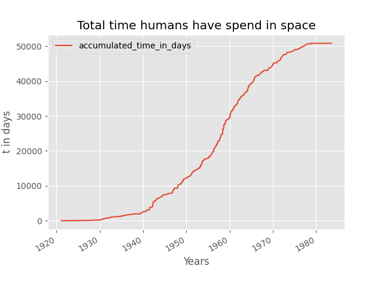
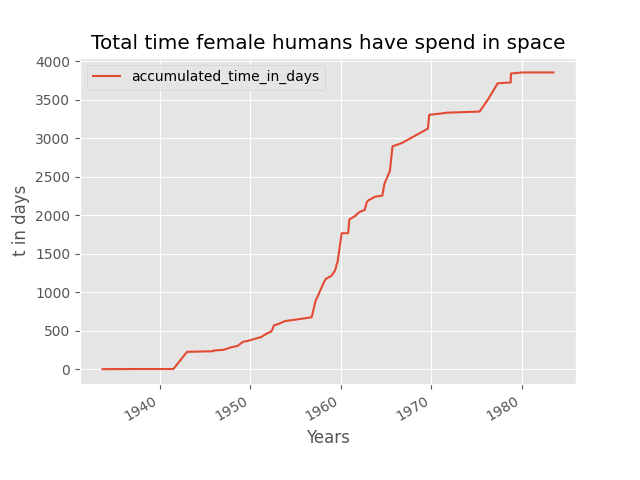
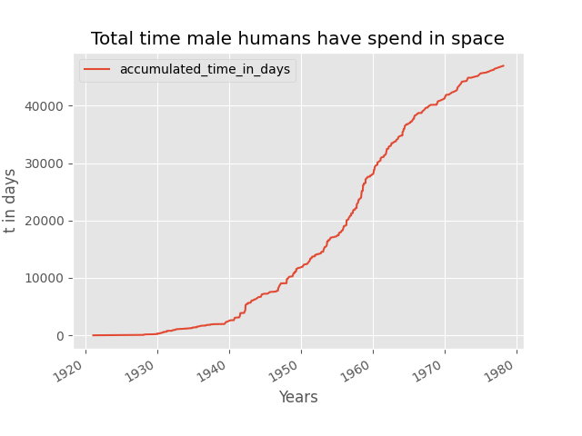
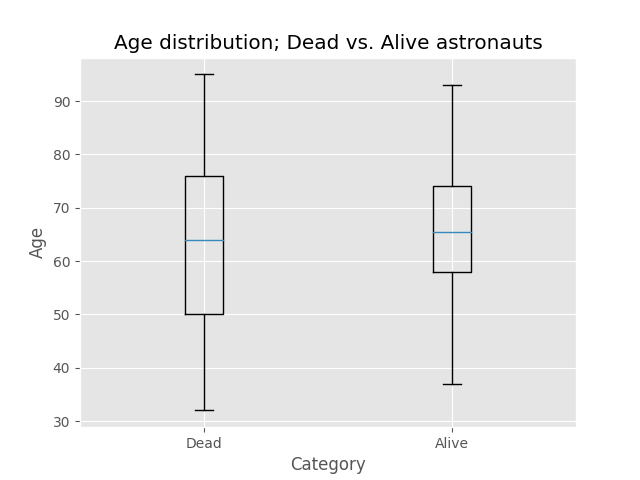
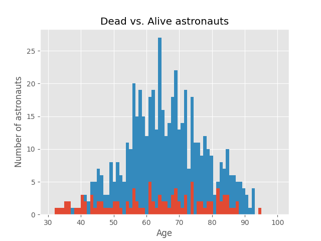

<!--
SPDX-FileCopyrightText: 2018 German Aerospace Center (DLR)
SPDX-License-Identifier: CC-BY-4.0
-->

# Introduction

This repository contains a software project that analysis some astronaut data and has been used to aid the material in ["Let's Make Your Script Ready for Publication
" workshop](https://gitlab.com/hifis/hifis-workshops/make-your-code-ready-for-publication/workshop-materials). The original [software project](https://gitlab.com/hifis/hifis-workshops/make-your-code-ready-for-publication/astronaut-analysis) is stored on GitLab. 

- It demonstrates every important step performed in the [workshop](https://gitlab.com/hifis/hifis-workshops/make-your-code-ready-for-publication/workshop-materials).
- Every branch shows the final results of a specific step.
- The default branch (this branch) adds further documentation and automates checking some details.

## Astronaut Analysis

This analysis is based on publicly available astronauts data from [Wikidata](https://www.wikidata.org/wiki/Wikidata:Main_Page).
In this context, we investigated aspects such as time humans spent in space as well as the age distribution of the astronauts.







The repository is organized as follows:

- [data](data): Contains the astronauts data set retrieved from Wikidata
- [code](code): Contains the astronaut analysis script
- [results](results): Contains the resulting analysis plots

## Astronaut Data

The data set has been generated using the following SPARQL query [[1]] (retrieval date: 2018-10-25).

You can also analyze a recent version of the astronaut data by replacing the data set and re-running the analysis script:
- Run the SPARQL query
- Download the resulting data formatted as JSON
- Replace the file `data/astronauts.json`
- Run the analysis script

[1]: https://query.wikidata.org/#%23Birthplaces%20of%20astronauts%0ASELECT%20DISTINCT%20%3Fastronaut%20%3FastronautLabel%20%3Fbirthdate%20%3FbirthplaceLabel%20%3Fsex_or_genderLabel%20%3Ftime_in_space%20%3Fdate_of_death%20WHERE%20%7B%0A%20%20%3Fastronaut%20%3Fx1%20wd%3AQ11631.%0A%20%20%3Fastronaut%20wdt%3AP569%20%3Fbirthdate.%0A%20%20%3Fastronaut%20wdt%3AP19%20%3Fbirthplace.%0A%20%20SERVICE%20wikibase%3Alabel%20%7B%20bd%3AserviceParam%20wikibase%3Alanguage%20%22en%22.%20%7D%0A%20%20OPTIONAL%20%7B%20%3Fastronaut%20wdt%3AP21%20%3Fsex_or_gender.%20%7D%0A%20%20OPTIONAL%20%7B%20%3Fastronaut%20wdt%3AP2873%20%3Ftime_in_space.%20%7D%0A%20%20OPTIONAL%20%7B%20%3Fastronaut%20wdt%3AP570%20%3Fdate_of_death.%20%7D%0A%7D%0AORDER%20BY%20DESC%28%3Ftime_in_space%29

## Astronaut Analysis Script

The script requires Python >= 3.8 and uses the libraries [pandas](https://pandas.pydata.org/) (*BSD 3-Clause License*) as well as [matplotlib](https://matplotlib.org/) (*Matplotlib License*).

> The script has been successfully tested on Windows 10 and Linux with Python 3.8.

### Installation

Please clone this repository and install the [required dependencies](code/requirements.txt) as follows:

```bash
git clone ...
cd astronaut-analysis/code
pip install -r requirements.txt
```

### Usage

You can run the script as follows:

```bash
python astronauts-analysis.py
```

The script processes the [astronauts data set](data/astronauts.json) and stores the plots in the same directory.
Existing result plots will be overwritten.

### Testing

The [test.sh](code/test.sh) script performs some basic checks to support maintaining the analysis script:

- It installs the required packages.
- It runs the [flake8](https://flake8.pycqa.org/en/latest/) linter to find programming mistakes and code style issues.
- It runs the analysis script and checks that the expected plots are produced.

> The script runs as part of the [GitLab build pipeline](.gitlab-ci.yml) to find errors introduced by new commits.

## Citation

If you use this work in a research publication, please cite the **specific version** that you used using the citation metadata on Zenodo [](https://doi.org/10.5281/zenodo.ZENODO-DOI).

You can find an overview about the different versions in the [changelog](CHANGELOG.md).

## Contributors

Here you find the main contributors to the material:

- Martin Stoffers
- Tobias Schlauch

## Changes

The [changelog](CHANGELOG.md) documents all notable changes.

## License

Please see the file [LICENSE.md](LICENSE.md) for further information about how the content is licensed.
